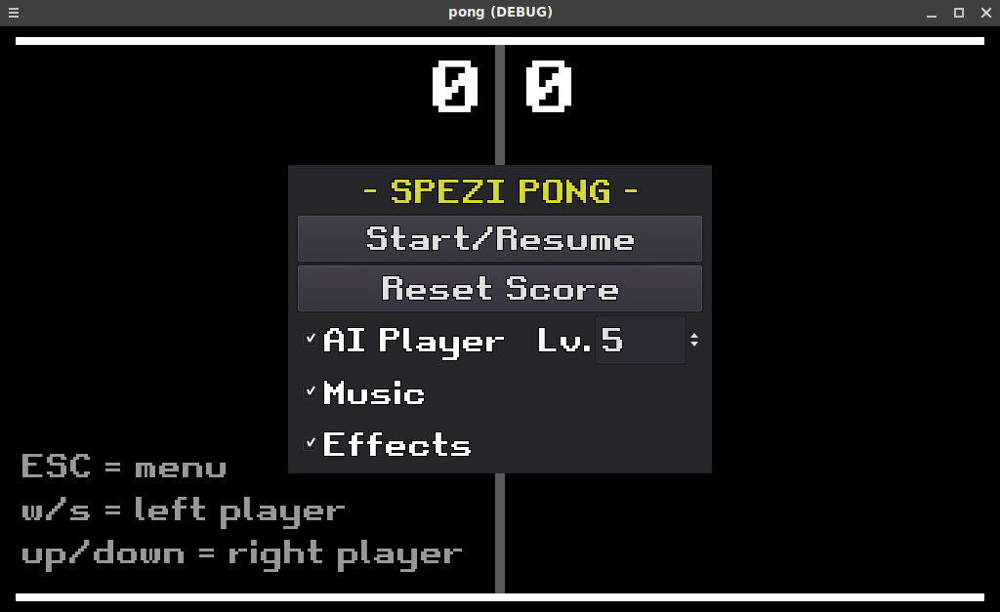

# spezi pong

Remake of the classic game.

**->** [Play here!](https://unspezifisch.github.io/pong/pong.html) **<-**

Features:

* single player mode against "AI"
* AI difficulty levels 0-9
* two player mode
* music and sound effects
* the finest graphics of 1976

Made with Godot 3.5 for the [20 games challenge](https://20_games_challenge.gitlab.io/).

## Screenshots

### Gameplay

### Menu

## Credits

* Godot Engine <https://godotengine.org/license>
* Retro Gaming font by Daymarius <https://www.dafont.com/retro-gaming.font> (Free for personal and commercial use)
* Music and sounds effects made by me, with [Vital](https://vital.audio/)

## License

GNU Affero General Public License v3.0 only ([AGPL-3.0-only](https://spdx.org/licenses/AGPL-3.0-only.html))

